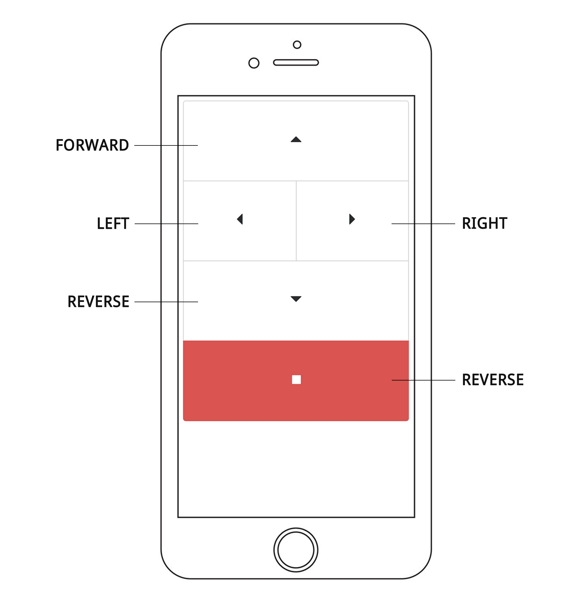

## Example

Should work in any modern browser.



## Usage

Use the following steps to configure a [nodebot-server][] to use this nodebot remote control:

- Clone [nodebot-remote-control](https://github.com/jonschlinkert/nodebot-remote-control) into a vendor folder in your nodebot project:

```sh
$ git clone https://github.com/jonschlinkert/nodebot-remote-control.git vendor/nodebot-remote-control
```

- Copy the files from `dist` into a folder in your nodebot project (we'll use `public`)

```sh
$ cp -R ./vendor/nodebot-remote-control/dist/ ./public
```

- Configure and start the [nodebot-server][] after connecting to your nodebot:

```js
var path = require('path');
var server = require('nodebot-server');
var options = {
  cwd: path.join(process.cwd(), 'public')
};

server(options, function(err, app) {
  if (err) {
    console.error(err);
    process.exit(1);
    return;
  }
  app.on('cmd', function(cmd) {
    // call function coorisponding to the command received
    nodebot[cmd]();
  });
});
```
